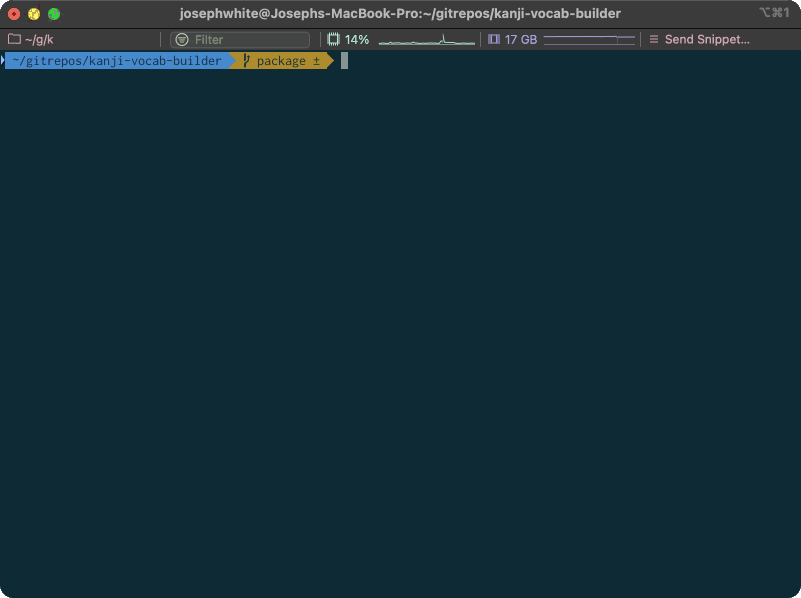

# Kanji Vocab Miner

This is a very simple CLI tool to help with learning Japanese kanji and vocabulary. It glues together Jisho (an online Japanese dictionary) and Anki (the flashcard program), and designed with a context-based learning approach to Kanji in mind; as new kanji are learned, we find new vocabulary that include those Kanji to learn the readings (rather that painful rote memorization of kun and on readings from kanji alone).



## What It Does

The tool allows for searching of either specific kanji or words.
- When a word is searched, it will look up the word on Jisho, display its details, and allow you to add it to your Anki vocabulary deck.
- When a kanji is searched, it will first look up the Kanji on Jisho, then fetch a list of vocabulary words that include that kanji, with details including JLPT level, whether the word already exists in your Anki deck and whether the other kanji in the word are already in your list of reviewed kanji. You can then select which words to add to your Anki vocabulary deck.

The workflow is designed to complement kanji study: as you learn new kanji, you naturally build vocabulary that reinforces those characters.

## Who is it for?
Originally just me!

There are literally hundreds of far more polished/sophisticated tools for learning Japanese available on the web. The use-case/workflow here is very niche to my own learning style and circumstances. You might find this tool useful if:
   - You are reading primarily printed Japanese texts (textbooks and novels) rather than online content, where vocabulary mining tools like Rikaichan, or learning apps like Todai are arguably far more useful/convenient.
   - You already have a decent base of spoken Japanese and are focusing on catching up on reading/writing skills (this may apply to learners who grew up speaking, but not reading/writing, Japanese).
   - You hate Duolingo and would actually like to learn a language properly!


## Installation

Using this tool requires some Anki setup:

1. **Anki Desktop** - Download from [apps.ankiweb.net](https://apps.ankiweb.net/)
2. **AnkiConnect Plugin** - Install from [AnkiWeb](https://ankiweb.net/shared/info/2055492159)
   - In Anki: Tools → Add-ons → Get Add-ons → Enter code `2055492159`. This plugin allows external programs to interact with Anki via a local API.
3. **"All in One Kanji" Deck** - Download from [AnkiWeb](https://ankiweb.net/shared/info/1862058740)
   - This is the recommended kanji deck that the tool expects by default.
   - File → Import → Browse to downloaded `.apkg` file
   - The tool will re-order existing cards from this deck for kanji study, while creating entirely

Once this is done (and Anki is running with AnkiConnect enabled), you can run the tool normally with uv.

```bash
git clone https://github.com/yourusername/kanji-vocab-miner.git
cd kanji-vocab-miner
uv sync
uv run kanji-vocab-miner setup
```


## Usage

### Interactive Mode

Make sure Anki is running and run `uv run kanji-vocab-miner` to start the interactive session:

**Commands:**
- `n` - Fetch next kanji from your Anki deck
- `c` - Commit selected words to Anki
- `q` - Quit the program
- Type a kanji directly (e.g., `食`) - Search for words containing that kanji
- Type `@word` (e.g., `@食べる`) - Look up a specific word on Jisho
- When in word selection mode, enter numbers or ranges (e.g., `1 3 5` or `1-5`) to select words to add


## Credits

- [Jisho.org](https://jisho.org/) for the excellent Japanese dictionary API
- [AnkiConnect](https://foosoft.net/projects/anki-connect/) for making Anki automation possible
- [All in One Kanji](https://ankiweb.net/shared/info/1862058740) deck creators (whoever you are!)
