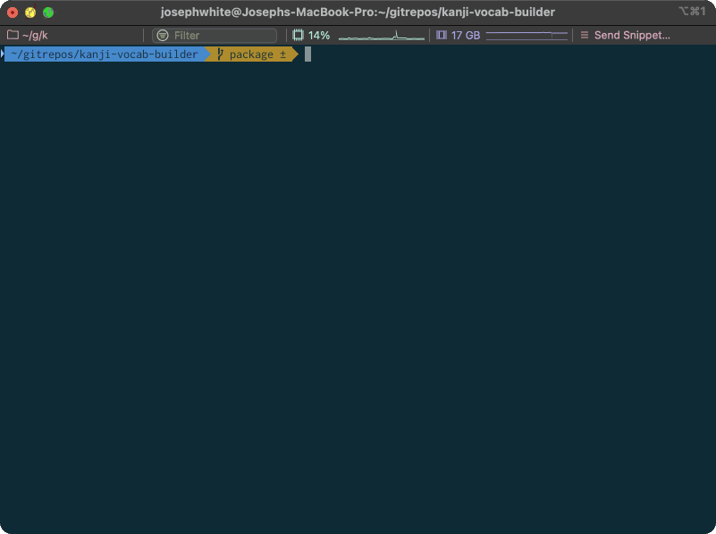

# Kanji Vocab Miner

This is a very simple CLI tool to help with learning Japanese kanji and vocabulary. It glues together Jisho (an online Japanese dictionary) and Anki (the flashcard program), and designed with a context-based learning approach to Kanji in mind; as new kanji are learned, we find new vocabulary that include those Kanji to learn the readings (rather that painful rote memorization of kun and on readings from kanji alone).



## What It Does

The tool allows for searching of either specific kanji or words.
- When a word is searched, it will look up the word on Jisho, display its details, and allow you to add it to your Anki vocabulary deck.
- When a kanji is searched, it will first look up the Kanji on Jisho, then fetch a list of vocabulary words that include that kanji, with details including JLPT level, whether the word already exists in your Anki deck and whether the other kanji in the word are already in your list of reviewed kanji. You can then select which words to add to your Anki vocabulary deck.

The workflow is designed to complement kanji study: as you learn new kanji, you naturally build vocabulary that reinforces those characters.

## Who is it for?
Originally just me!

There are literally hundreds of far more polished/sophisticated tools for learning Japanese available on the web. The use-case/workflow here is very niche to my own learning style and circumstances. You might find this tool useful if:
   - You are reading primarily printed Japanese texts (textbooks and novels) rather than online content, where vocabulary mining tools like Rikaichan, or learning apps like Todai are arguably far more useful/convenient.
   - You already have a decent base of spoken Japanese and are focusing on catching up on reading/writing skills (this may apply to learners who grew up speaking, but not reading/writing, Japanese).
   - You hate Duolingo and would actually like to learn a language properly!


## Installation

Using this tool requires some Anki setup:

1. **Anki Desktop** - Download from [apps.ankiweb.net](https://apps.ankiweb.net/)
2. **AnkiConnect Plugin** - Install from [AnkiWeb](https://ankiweb.net/shared/info/2055492159)
   - In Anki: Tools → Add-ons → Get Add-ons → Enter code `2055492159`. This plugin allows external programs to interact with Anki via a local API.
3. **"All in One Kanji" Deck** - Download from [AnkiWeb](https://ankiweb.net/shared/info/1862058740)
   - This is the recommended kanji deck that the tool expects by default.
   - File → Import → Browse to downloaded `.apkg` file
   - The tool will re-order existing cards from this deck for kanji study, while creating entirely

Once this is done (and Anki is running with AnkiConnect enabled), install the tool with [uv](https://docs.astral.sh/uv/):

```bash
uv tool install git+https://github.com/yourusername/kanji-vocab-miner.git
kanji-vocab-miner setup
```

This installs `kanji-vocab-miner` globally so you can run it from any directory. If you don't have uv installed, follow the [uv installation guide](https://docs.astral.sh/uv/getting-started/installation/).

To update to the latest version:

```bash
uv tool upgrade kanji-vocab-miner
```


## Usage

### Interactive Mode

Make sure Anki is running and run `kanji-vocab-miner` to start the interactive session:

**Commands:**
- `n` - Look up the kanji on the card currently open in Anki Reviewer
- `a` - Move the most recently looked-up kanji card to the top of its Anki deck
- `c` - Commit selected words to Anki
- `q` - Quit the program
- Type a kanji directly (e.g., `食`) - Search for words containing that kanji and show whether its Anki card has been reviewed
- Type `@word` (e.g., `@食べる`) - Look up a specific word on Jisho
- When in word selection mode, enter numbers or ranges (e.g., `1 3 5` or `1-5`) to select words to add

### Progress dashboard

Run `kanji-vocab-miner stats` to show your Kanji, Reading, Grammar, and
vocabulary progress. Overall bars appear together at the top, followed by
Kanji and textbook-part breakdowns. Vocabulary is measured against a core
6,000-word target: the tool adds every vocabulary note created on or after the
configured tracking date to the manually estimated baseline.

For now, the file is read from the directory where you run the command. When
working from this repository, edit the included `manual_progress.toml` and run
`uv run kanji-vocab-miner stats` from the repository root.

The file contains:

```toml
vocab_baseline = 4400
vocab_tracking_start = 2026-09-03

reading_i = 0
reading_ii = 0
reading_iii = 0
grammar_i = 0
grammar_ii = 0
grammar_iii = 0
```

`vocab_baseline` is the known-word estimate on `vocab_tracking_start`.
Vocabulary notes added to the configured deck from that date onward increase
this count, whether or not they have been reviewed yet.

Each Reading and Grammar value is an independent count of completed sections.
Reading has totals of I=41, II=29 (book sections 42–70), and III=11, for an
aggregate of 81. Grammar has totals of I=10, II=11 (book sections 11–21), and
III=5 (book sections 22–26), for an aggregate of 26.


## Credits

- [Jisho.org](https://jisho.org/) for the excellent Japanese dictionary API
- [AnkiConnect](https://foosoft.net/projects/anki-connect/) for making Anki automation possible
- [All in One Kanji](https://ankiweb.net/shared/info/1862058740) deck creators (whoever you are!)
